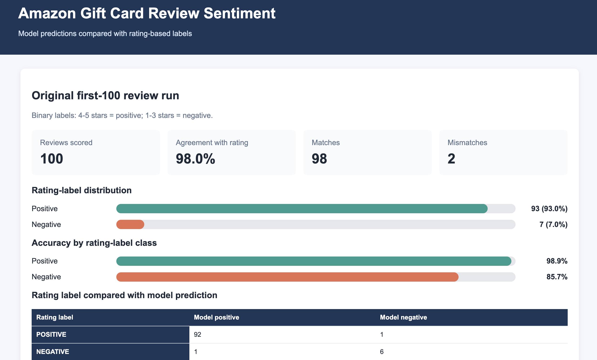
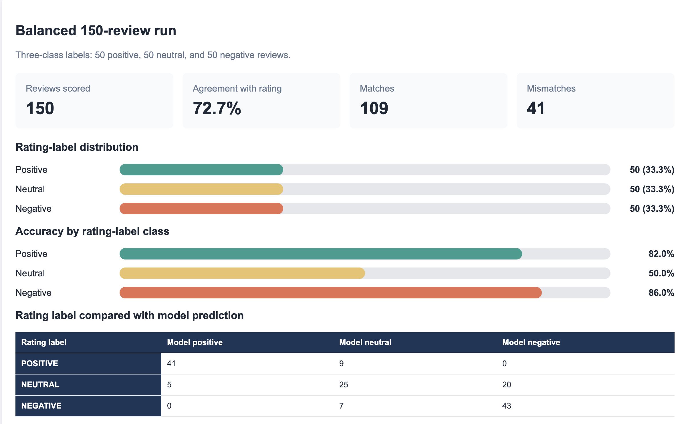

# Assignment 1: Amazon Gift Card Review Classification Report

## Project overview

This project uses an LLM to classify Amazon Gift Card reviews based only on the review title and text. The model was not given a star rating. Star ratings were used only after the classification was complete, so they could be used as comparison labels.

The project includes two sentiment classification runs:

1. The first 100 reviews were classified as `POSITIVE` or `NEGATIVE`.
2. A balanced sample of 150 reviews was classified as `POSITIVE`, `NEUTRAL`, or `NEGATIVE`.

The project also compares an LLM-selected primary emotion with an emotion identified by the NRC Emotion Lexicon. Results are shown in a self-contained HTML dashboard.

## Data source

This project used the `Gift_Cards.jsonl.gz` review file from the Amazon Reviews’23 dataset.

**Citation:** Hou, Y., Li, J., He, Z., Yan, A., Chen, X., & McAuley, J. (2024). *Bridging Language and Items for Retrieval and Recommendation*. arXiv:2403.03952. [Amazon Reviews’23 dataset](https://amazon-reviews-2023.github.io/) and [Gift Cards review data file](https://mcauleylab.ucsd.edu/public_datasets/data/amazon_2023/raw/review_categories/Gift_Cards.jsonl.gz).

## Classification method

The model received only a review’s title and text. It did not receive, use, or infer the star rating.

For the first 100-review run, ratings were converted into binary comparison labels:

- 4–5 stars = `POSITIVE`
- 1–3 stars = `NEGATIVE`

For the balanced 150-review run, ratings were converted into three comparison labels:

- 4–5 stars = `POSITIVE`
- 3 stars = `NEUTRAL`
- 1–2 stars = `NEGATIVE`

The revised three-class prompt instructed the model to use `NEUTRAL` for reviews with mixed feelings, low enthusiasm, short or unclear opinions, and language such as “fine” or “not bad.” It also instructed the model to classify a one-word review of “good” as neutral.

## First 100-review run

The first 100 reviews were highly unbalanced.

| Rating-label class | Number of reviews | Percent of reviews |
|---|---:|---:|
| Positive | 93 | 93.0% |
| Negative | 7 | 7.0% |

| Measure | Result |
|---|---:|
| Reviews scored | 100 |
| Matches | 98 |
| Mismatches | 2 |
| Agreement with rating labels | 98.0% |
| Positive accuracy | 98.9% |
| Negative accuracy | 85.7% |

### Prediction matrix

| Rating label | Model positive | Model negative |
|---|---:|---:|
| Positive | 92 | 1 |
| Negative | 1 | 6 |

The 98.0% agreement score looks very high, but the first 100 reviews are not a balanced evaluation set. Because 93 of the 100 reviews were labeled positive, a model that predicted `POSITIVE` for every review would already receive 93.0% overall accuracy. Therefore, the high overall score is strongly influenced by the large number of positive reviews.

This imbalance does not change how the model makes an individual prediction because the model was not trained on these 100 reviews. However, it makes the overall accuracy score appear stronger than it would on a dataset with equal numbers of positive and negative reviews.

The negative-class accuracy should also be interpreted carefully because it is based on only seven reviews. One incorrect negative prediction changes the negative accuracy by approximately 14 percentage points. The balanced 150-review run provides a fairer comparison because it contains the same number of positive, neutral, and negative reviews.

Two mismatches also show that a star rating does not always match the written sentiment. Review 18 had a five-star rating but included a complaint about a missing gift note, so the model classified it as negative. Review 99 had a three-star rating but said the card was “Very easy to use,” so the model classified it as positive.

## Balanced 150-review run

The second run used a balanced sample of 150 reviews: 50 positive, 50 neutral, and 50 negative.

| Rating-label class | Number of reviews | Percent of reviews |
|---|---:|---:|
| Positive | 50 | 33.3% |
| Neutral | 50 | 33.3% |
| Negative | 50 | 33.3% |

| Measure | Result |
|---|---:|
| Reviews scored | 150 |
| Matches | 109 |
| Mismatches | 41 |
| Agreement with rating labels | 72.7% |

| Rating-label class | Accuracy |
|---|---:|
| Positive | 82.0% |
| Neutral | 50.0% |
| Negative | 86.0% |

### Prediction matrix

| Rating label | Model positive | Model neutral | Model negative |
|---|---:|---:|---:|
| Positive | 41 | 9 | 0 |
| Neutral | 5 | 25 | 20 |
| Negative | 0 | 7 | 43 |

The balanced sample gives a more useful measure of performance because all three classes have the same number of reviews. The model performed well on clearly positive and clearly negative reviews. It correctly classified 41 of 50 positive reviews and 43 of 50 negative reviews.

The neutral class was the most difficult. The model correctly classified 25 of 50 neutral reviews. It classified 20 neutral reviews as negative and 5 as positive. Many three-star reviews included direct complaints about damaged packaging, gift cards not working, missing messages, late delivery, fees, or an unexpected process. The model often reasonably interpreted this language as negative, even though the rating-based rule treated every three-star review as neutral.

This result shows a limitation of star ratings as comparison labels. A three-star rating can represent a genuinely neutral opinion, but it can also contain strongly negative written feedback. The model classified the review text rather than the rating, which explains many of the mismatches.

## LLM emotion compared with NRC emotion

The LLM selected one primary emotion by considering the full review title and text. Positive reviews were often labeled with emotions such as `joy` or `trust`. Negative reviews were often labeled with `anger`, `sadness`, or `disgust`.

The NRC Emotion Lexicon method used a fixed list of emotion-related words. It sometimes returned a different result from the LLM because it identifies words rather than interpreting the entire meaning of the review. For example, the NRC method sometimes identified `anticipation` in gift-related reviews because of words connected to receiving or giving a gift, while the LLM identified the overall emotion as `joy`.

The LLM can consider context, negation, and mixed statements. The NRC method is more literal and transparent because it follows a fixed word list. The dashboard displays both results for the first 100-review run so that the differences can be reviewed.

## Problems and workarounds

- **Slow model calls:** Each review required a separate model request, so classifying 100 or 150 reviews took time. The script printed progress messages so the process could be monitored.
- **Very short reviews:** Some reviews contained only one word or a very short statement. The revised three-class prompt added specific neutral rules for short, weak, or unclear opinions.
- **Mixed review sentiment:** Some reviews included both a positive and negative statement. The revised prompt instructed the model to classify mixed reviews as neutral when the overall sentiment was not clearly positive or negative.
- **Ratings and text did not always agree:** The star rating was retained as the assignment comparison label, but the written review sometimes supported a different sentiment classification.
- **Emotion disagreement:** The LLM and NRC emotion labels sometimes differed because the LLM used context while the NRC method used individual lexicon words.

## Files included

- `Assignment1.py` — binary sentiment classification for the first 100 reviews
- `step6_prompt_change_3class.py` — balanced 150-review three-class classification
- `add_nrc_emotions.py` — NRC Emotion Lexicon analysis
- `create_dashboard.py` — self-contained dashboard generator
- `first_100_with_emotions.jsonl` — first 100-review output
- `balanced_150_revised_prompt_v2_predictions.jsonl` — balanced 150-review output
- `dashboard.html` — final dashboard

## Dashboard screenshots

